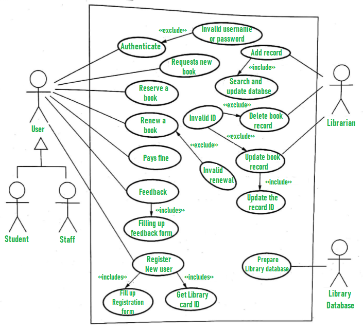
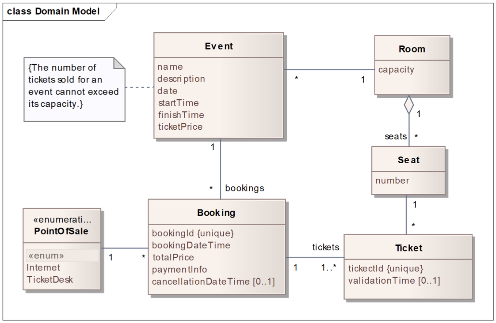

# 3 - Requirements Engineering

Processo de estudo das necessidades do cliente para obter uma definição concreta do sistema, tanto de hardware necessário como de requisitos de software. Um `requisito de software` é uma propriedade de um sistema para resolver um determinado problema. <br>

Um dos tópicos para o sucesso do projecto é a visão objectiva dos requisitos e o envolvimento ativo do utilizador ou cliente durante todas as fases de desenvolvimento do mesmo.

### Principais problemas da engenharia de requisitos:

1. Escassa comunicação desenvolvedor-cliente;
2. Conhecimentos implícitos;
3. Crescimento do produto não controlado;
4. Mudanças repentinas nos requisitos;

### Tipos de requisitos

#### 1 - Requisitos funcionais

Descrevem as funções que o software tem de executar, também conhecido como as capacidades do sistema.

#### 2 - Requisitos não funcionais

Atuam como restrições ao sistema. Como por exemplo "o sistema tem um período máximo de down de 8 horas por ano - também conhecido como disponibilidade" ou "o produto deve ser desenvolvido em Java".

### Algumas características de qualidade

- Manutenção (modularidade, reusabilidade, testável ou não...);
- Segurança (integridade, autenticidade, confiabilidade...);
- Usabilidade (simples, operacional, proteção contra erros, acessibilidade...);

### Exemplos de stakeholders - interessados

- Quem paga pelo sistema - clientes;
- Utilizadores finais;
- Pessoas responsáveis por manter o sistema;
- Clientes da organização que utiliza o sistema;
- Os que influenciam no sistema, direta ou indiretamente;

## Processo da Engenharia de Software

#### 1 - Elicitation / Elicitação

Interagir com os `stakeholders` e outras organizações que irão utilizar o produto para descobrir as suas verdadeiras necessidades e requisitos. As entrevistas podem ser abertas/não estruturadas (boas para o início da exploração) ou fechadas/estruturadas, para obter conhecimento mais fino através das questões dos desenvolvedores;

#### 2 - Analysis / Análise

Arranjar da melhor forma a informação coletada, compreensível, consistente e clara, para que haja uma lista de prioridades para cumprir com os requisitos;

#### 3 - Specification / Especificação

Produzir a documentação dos requisitos com o detalhe apropriado, dependendo do contexto;

#### 4 - Validation / Validação

Garantir que a documentação gerada no passo anterior faz cumprir os objectivos da equipa e do negócio;

## Artefactos da Engenharia de Requisitos

1. Lista de requisitos, os seus possíveis atributos e características. Muitas vezes organizadas em conjuntos dependendo da prioridade;
2. Modelo do sistema, como os "use cases" e "user stories" abordados mais à frente;
3. Interfaces de utilização - mockups;
4. Testes de aceitação, abordados mais à frente;

# User Stories

Deve incluir respostas às perguntas "Como? Quem? Porquê?" e seguir a tipologia INVEST:

`I` - Independent, de umas das outras <br>
`N` - Negotiable <br>
`V` - Valuable <br>
`E` - Estimable <br>
`S` - Small <br>
`T` - Testable

Exemplo: "`As a` automobile driver, `I want to be able to` remotely start my car, `so that it` will be warmed up by time I get to it"

# Acceptance Tests

Os testes de aceitação são definidos pelo cliente para decidir requisitos e funcionalidades. Em processo ágil, mais do que um teste deve ser realizado com base num user story, atingindo o BDD(Behavior-Driven-Development). A estrutura é a seguinte, desenvolvida com a linguagem [Gherkin](https://cucumber.io/docs/gherkin/reference/):

```gherkin
Given [initial context or preconditions]
When [event(s) occur(s)]
Then [ensure some outcomes or postconditions]
```

# Mockups

Protótipo da aplicação, como um modelo primitivo do sistema. Acaba por ser barato, simples e rápido e dá para limar as arestas dos requisitos de acordo com o cliente. Há dois tipos

1. Throw-away prototype: em papel ou em computador, mais baseado nos requisitos do que na implementação. Enquanto que em papel são mais rápidos e fáceis, mas menos fidedignos, em computador podem ser usados numa perspectiva evolutiva, embora exijam mais tempo, custo e conhecimento;
2. Evolutionary prototype: apropriado para um desenvolvimento rápido e interativo com um grande envolvimento do utilizador;

# Use Case Modeling

<p align = "center" >
  
    <h4 align = "center">Exemplo</h4><br>
</p>


O esquema deve ser seguido de uma tabela onde se explora os seguintes tópicos:

|||
| --- | --- |
| *Name* | Purchase tickets online |
| *Actor* |  Customer | 
| *Description* | The customer purchases one or more tickets for an event, using an electronic payment method, having the option to choose places. |
| *Preconditions* | - The customer has electronic payment means. <br> - The event has tickets available on-sale. |
| *Postconditions* | - The customer gets the electronic tickets with a QR code. <br> - The customer is charged of the tickets’ cost, and the seller credited. <br> - Information of tickets sold & seats available for the event is updated. |
| *Normal flow* | 1. The customer accesses the web page of the ticketing system.<br> 2. The system shows the list of events with tickets on-sale.<br> 3. The customer selects the event and the number of tickets.<br> 4. If wanted, the costumer may Choose Places.<br> 5. The system shows the total price to pay.<br> 6. The system redirects the customer to Electronic Payment.<br> 7. The system delivers the electronic tickets to the customer with a unique identifier and QR code. |
| *Alternative flows and exceptions* | 1. [Payment failure] If, in step 6 of the normal flow the payment fails, the system gives the user the possibility to cancel or retry. |

# Domain Models

Podem ser representados através de diagramas de classe UML e com documentação associada, como por exemplo as restrições de cada classe. <br>

Usado para organizar vocabulário da linguagem. As classes representam conceitos e os conceitos podem ser descritos textualmente, sendo a maior informação transmitida pelos atributos de cada classe.

<p align = "center" >
  
    <h4 align = "center">Exemplo</h4><br>
</p>
